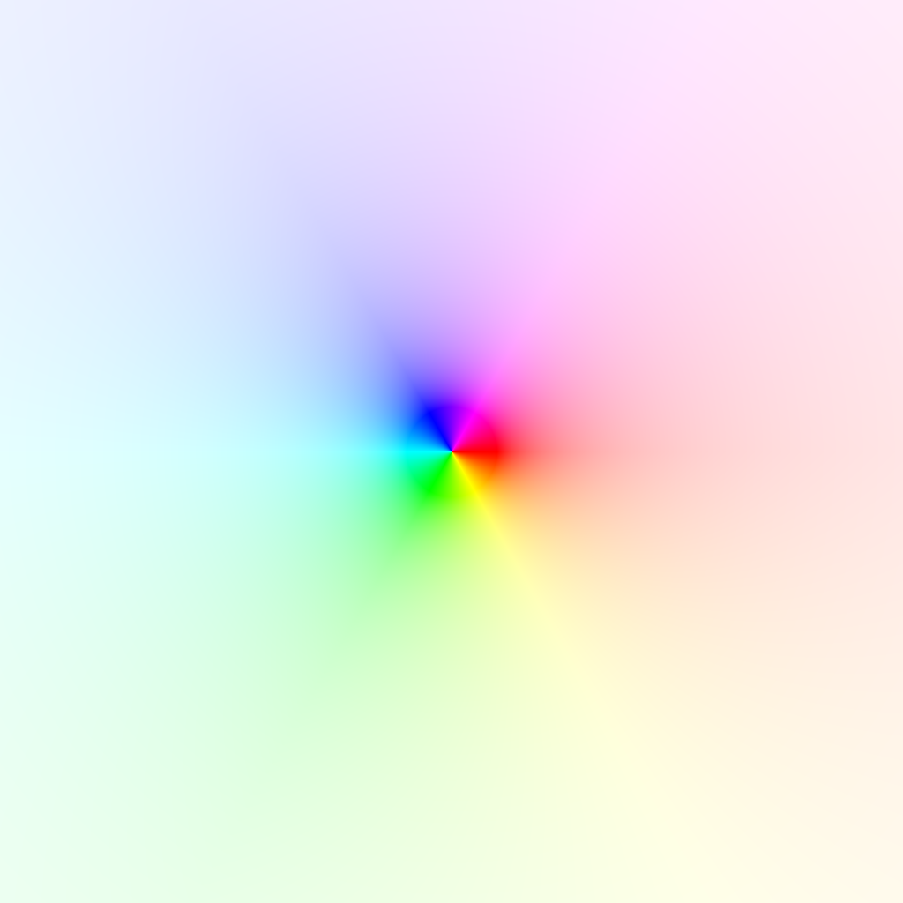
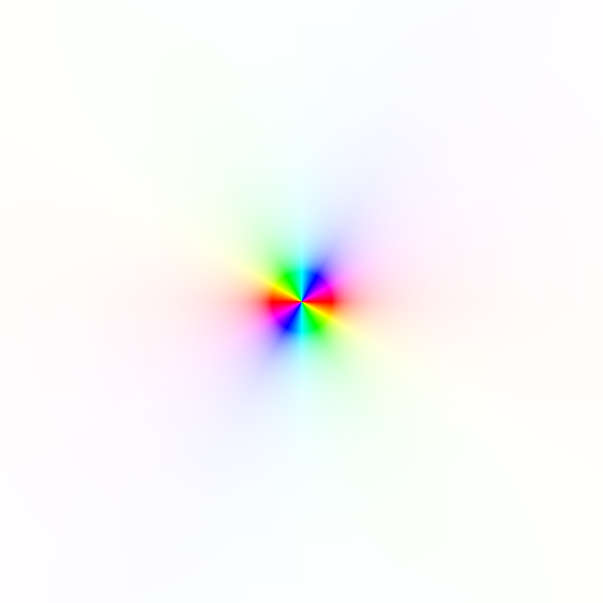
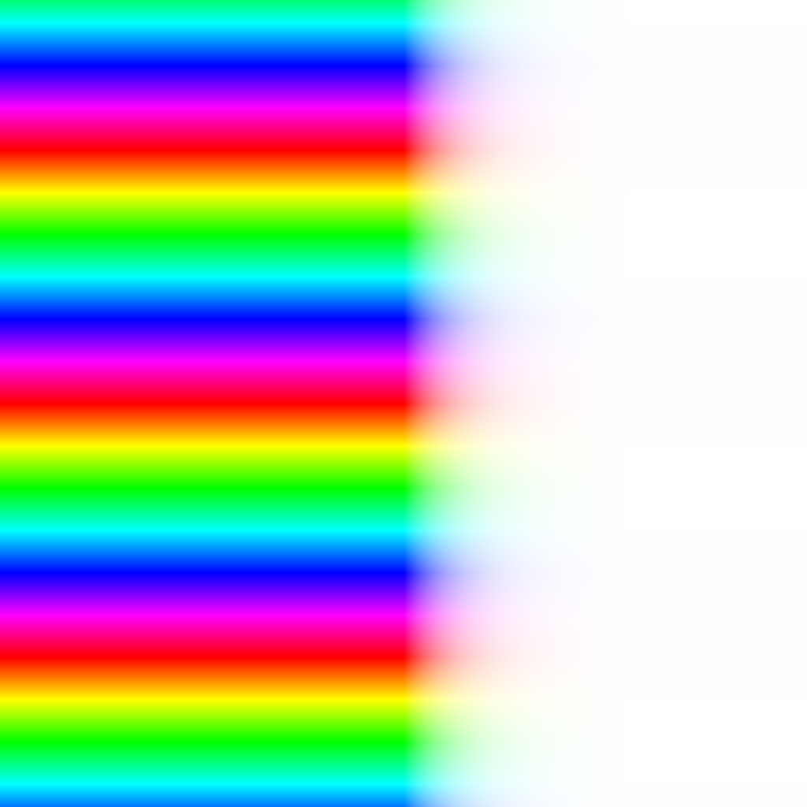
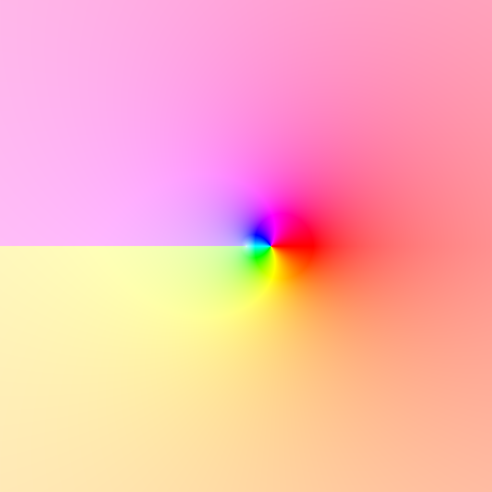

# complex-hsv

Graph complex functions using hsv colors.

The idea here is we graph the inputs on a normal plane, and then
the outputs using hue and saturation (polar: hue = theta, sat = r).
Perhaps more robust systems exist; I'm not well versed in the study
of complex functions, but maybe this will be helpful.

## Usage

Currently you need to change the definition of `fn` in `src/Run.hs` to change the graph.
You can run the program with `stack run -- complex-hsv-exe -v`.

The program has a few command line options; the most important are `-r RES`, where RES is the number of pixels on the side of the image, `-i (MINA,MAXA,MINB,MAXB)`, which specifies the window size MATLAB-style, and `-o FILENAME.png`, which specifies where to save the graph image. You can see the rest of the options by running `stack run -- complex-hsv-exe --help`.

## Gallery

* `f(z) = z`:
  
* `f(z) = z**2`:
  
* `f(z) = e**z`:
  
* `f(z) = ln z`:
  

